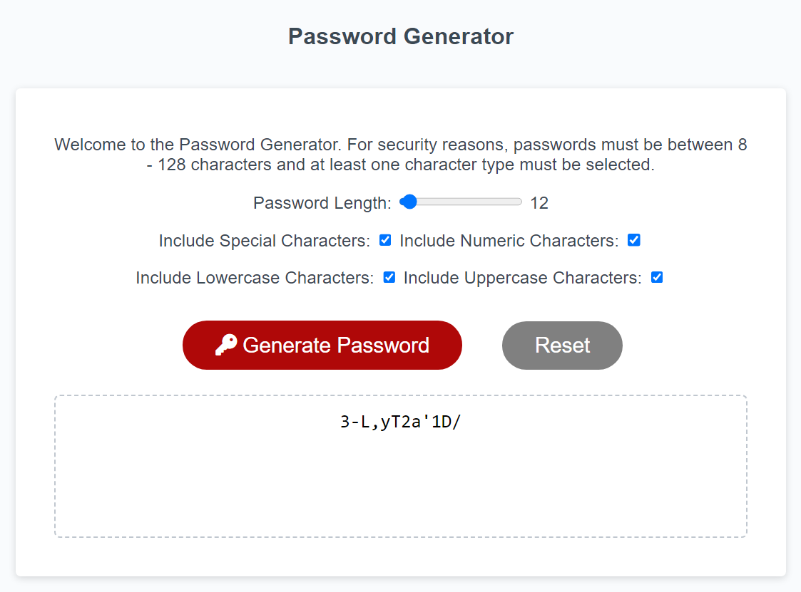

# Password-Generator-Kelly-Bearne

## Description

This project fullfils the criteria of building an application that an employee can use to generate a random password based on criteria they’ve selected.

Generated passwords must contain at least one character set type (selectable by the user) and be between 8 - 128 characters in length. The application validates on each input to ensure that these conditions are met.

The codebase follows best practice throughout (e.g. semantic HTML, class / ID naming conventions, indentation and quality comments).

## Installation

N/A

## Usage

Access the deployed application at the following URL: https://kbearne.github.io/Password-Generator-Kelly-Bearne

This application runs in the browser and dynamically updates HTML and CSS (powered by JavaScript code). 

This site is responsive to mobile and desktop; achieved through the use of media queries.

## Built with

  

## License

MIT license